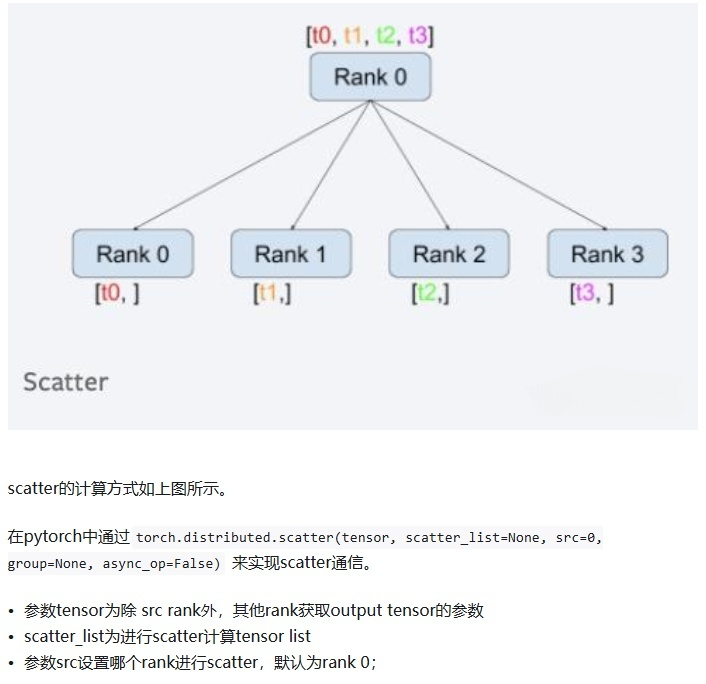
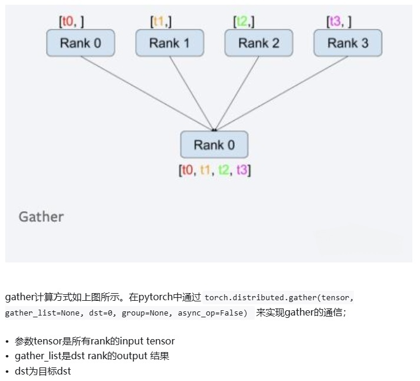
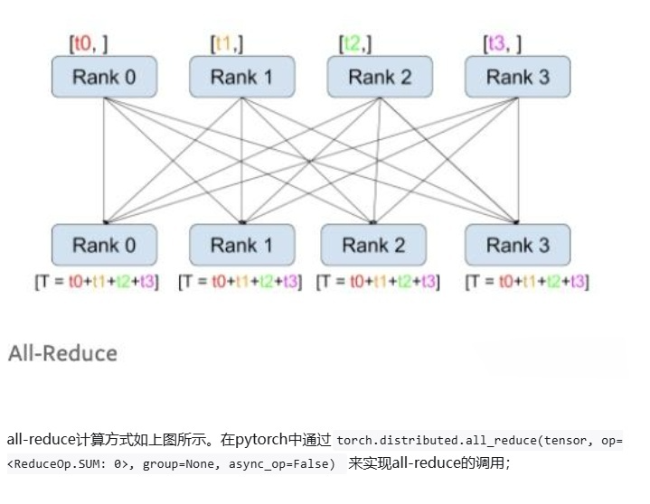

<div align="center">

# 分布式训练

</div>

## 目录
1. [MapReduce Theory](#1)
1. [DP](#2) 
1. [DDP](#3)
1. [Pipeline Parallelism](#4)
1. [Tensor Parallelism](#5)
1. [FSDP](#6)
1. [DeepSpeed](#7)

<a id=1>

## 1. MapReduce Theory

</a>

<details>
<summary></summary>

### 1.1 MapReduce


### 1.2 通信原语


* broadcast

* scatter

* gather

* reduce

* all-gather

* all-reduce

</details>

<a id=2 >

## 2. DataParallel —— 数据并行

</a>

<details>
<summary></summary>

### 2.1 模型加载流程
duplicate --> scatter --> parallel_apply --> gather  
Note: 模型分布以后，权重并非叶子节点

<details>
<summary><i>python code</i></summary>

```python
import torch
from torch import nn
class model(nn.Module):
    def __init__(self):
        super(model,self).__init__()
        self.l1=nn.Linear(1000,1000)
        self.l2=nn.Linear(1000,1)
        for p in self.l1.parameters():
            nn.init.ones_(p)
        for p in self.l2.parameters():
            nn.init.ones_(p)
    def forward(self,x):
        return self.l2(self.l1(x))
'''
def replicate(
    network: T,
    devices: Sequence[Union[int, torch.device]],
    detach: bool = False,
) -> List[T]:
detach=False 表示训练过程共享梯度
'''
replicas = nn.parallel.replicate(model().to('cuda:2'), devices=[2, 3, 4],detach=False)
'''
r"""Slice tensors into approximately equal chunks and distributes them across given GPUs.

Duplicates references to objects that are not tensors.
"""
'''
x=torch.randn(6, 1000)
inputs = nn.parallel.scatter(x,target_gpus=[2, 3, 4],dim=0)
'''
r"""Apply each `module` in :attr:`modules` in parallel on each of :attr:`devices`.

'''
outputs = nn.parallel.parallel_apply(replicas, inputs)
'''
r"""Gathers tensors from multiple GPU devices.
'''
result = nn.parallel.gather(outputs, target_device=2)
replicas[0].l1.weight.retain_grad()  # 显式保留梯度
replicas[1].l1.weight.retain_grad()  # 显式保留梯度
replicas[2].l1.weight.retain_grad()  # 显式保留梯度
m=model()
m(x).sum().backward()
result.sum().backward()

'''
print(m.l1.weight.grad[0][0]) #tensor(-6.6305)
print(replicas[0].l1.weight.grad[0][0]) #tensor(-2.4735, device='cuda:2')
print(replicas[1].l1.weight.grad[0][0]) #tensor(-0.8349, device='cuda:3')
print(replicas[2].l1.weight.grad[0][0]) #tensor(-3.3222, device='cuda:4')
'''
```
</details>


### 2.2 数据加载流程
`PyTorch` 中的 `Dataloader` 提供使用多个进程（通过 `num_workers` > 0 设置）从磁盘加载数据以及将多页数据从可分页内存到固定内存的能力（通过设置 `pin_memory` = True）  `分页内存->固定内存`   
当 `pin_memory`=`True` 时，`PyTorch` 会将数据固定到 `CPU` 的内存中，确保每个批次的数据可以被直接传输到 `GPU`。然后，`PyTorch` 会通过 异步数据传输 将数据从 `CPU` 传输到 `GPU`，这样在数据传输期间，`CPU` 就可以继续执行其他操作（例如，加载下一个批次的数据），从而提高了数据处理的效率。


### 2.3 封装接口实现
```python
m = nn.DataParallel(model().to('cuda:2'),device_ids=[2,3,4])
output = m(torch.ones(6,1000))
```

主节点 GPU 执行 reduce 归约梯度操作，并将更新后的结果同步到从属 GPU     
Note: 单进程多线程，python `GIL锁` 限制性能。

### 2.4 DataParallel 缺点  
1. 冗余数据副本        
数据从主机复制到主GPU，然后将子集分散在其他GPU上
2. 在前向传播之前跨GPU进行模型复制     
由于模型参数是在主GPU上更新的，因此模型必须在每次正向传递的开始时重新同步
3. 每批的线程创建/销毁开销     
并行转发是在多个线程中实现的（这可能只是PyTorch问题）
4. 梯度Reduce流水线机会未开发    
在Pytorch 1.0数据并行实现中，梯度下降发生在反向传播的末尾。
5. 在主GPU上不必要地收集模型输出output
6. GPU利用率不均   
在主GPU上执行损失loss计算; 梯度下降，在主GPU上更新参数 

</details>

<a id=3>

## 3. DistributedDataParallel  —— 分布式数据并行

</a>
<details>
    <summary> </summary>

`DistributedDataParallel` 支持 `all-reduce`，`broadcast`，`send` 和 `receive` 等等。通过 `MPI` 实现 `CPU` 通信，通过 `NCCL` 实现 `GPU` 通信。可以用于单机多卡也可用于多机多卡。

`torch.distributed` 相对于 `torch.nn.DataParalle` 是一个底层的 API，与 `DataParallel` 的单进程控制多 GPU 不同，在 `distributed` 的帮助下，我们只需要编写一份代码，`torch` 就会自动将其分配给 n 个进程，分别在 n 个 GPU 上运行。不再有主 GPU ，每个 GPU 执行相同的任务。对每个 GPU 的训练都是在自己的过程中进行的。每个进程都从磁盘加载其自己的数据。`分布式数据采样器`可确保加载的数据在各个进程之间不重叠。损失函数的前向传播和计算在每个 GPU 上独立执行。因此，不需要收集网络输出。在反向传播期间，梯度下降在所有 GPU 上均被执行，从而确保每个 GPU 在反向传播结束时最终得到平均梯度的相同副本。


适用情况： 单机多卡、多机多卡、可结合模型并行

* `DistributedDataParallel` 使用流程    
1. 在使用 `distributed` 包的任何其他函数之前，需要使用 `init_process_group` 初始化进程组，同时初始化 `distributed` 包。
2.  如果需要进行小组内集体通信，用 `new_group` 创建子分组
3.  创建分布式并行模型 `ddp(model, device_ids=device_ids)`
4.  为数据集创建 `Sampler`
5.  使用启动工具 `torch.distributed.launch` 在每个主机上执行一次脚本，开始训练
6.  使用 `destory_process_group()` 销毁进程组

### 3.1 单机多卡训练
#### 3.1.1 数据和模型定义

<details>
<summary><i>python code</i></summary>

```python
import torch
from torch import nn
import os
import argparse
import torch.distributed
class model(nn.Module):
    def __init__(self):
        super(model,self).__init__()
        self.l1=nn.Linear(1000,1000)
        self.bn=nn.BatchNorm1d(1000)
        self.l2=nn.Linear(1000,1)
        for p in self.l1.parameters():
            nn.init.ones_(p)
        for p in self.l2.parameters():
            nn.init.ones_(p)
    def forward(self,x):
        return self.l2(self.bn(self.l1(x)))

class dataset(torch.utils.data.Dataset):
    def __init__(self):
        super(dataset,self).__init__()
        self.data = torch.eye(1000,1000)
    
    def __getitem__(self,index):
        return self.data[index],index
    def __len__(self):
        return len(self.data)
```
</details>

#### 3.1.2 训练方式1-单机多卡高效分布式训练
<details>
<summary><i>python code</i></summary>

```python
def train(rank,args):# rank 参数 由 torch.multiprocessing.spawn 自动分配，序号从可用的 GPU 编号中获取（0，1，2，3）
    # 进程组初始化
    torch.distributed.init_process_group(backend='nccl',rank=rank,world_size=args.world_size) # world_size 和 rank 此时直接从进程的环境变量中获取
     
    # 根据 local_rank 确定当前进程使用的GPU
    local_rank=rank
    device=torch.device('cuda',local_rank)
    
    # 分布式加载数据
    data = dataset()
    sampler = torch.utils.data.distributed.DistributedSampler(data,num_replicas=args.world_size, rank=rank, shuffle=True)# num_replicas 和 rank 默认从环境变量中获取
    dataloader=torch.utils.data.DataLoader(data,pin_memory=True,shuffle=False,sampler=sampler,num_workers=args.num_workers,batch_size=args.batch_size) # pin_memory=True 锁业内存 -> 固定内存

    net=model()
    net.to(device)
    #BN->SyncBN
    net=torch.nn.SyncBatchNorm.convert_sync_batchnorm(net) # 将 model 中的 BN 替换成分布式的 BN

    if torch.cuda.device_count() > 1:
        net = torch.nn.parallel.DistributedDataParallel(net,device_ids=[local_rank],output_device=local_rank)
    loss_fn=nn.MSELoss()
    optimizer = torch.optim.SGD(net.parameters(), lr=0.001)
    for epoch in range(args.num_epochs):
        # 设置sampler的epoch，DistributedSampler需要这个来维持各个进程之间的相同随机数种子
        dataloader.sampler.set_epoch(epoch)
        for data, label in dataloader:
            # print(net.module.l1.weight[0][0])
            prediction = net(data)
            loss = loss_fn(prediction.squeeze(1), label.to(torch.float32).to(device))
            optimizer.zero_grad()
            loss.backward() 
            optimizer.step()     # 所有进程的梯度同步自动进行
            print(loss)
    torch.distributed.destroy_process_group()

if __name__=="__main__":
    os.environ['CUDA_VISIBLE_DEVICES'] = '4,5,6,7' 
    os.environ['MASTER_ADDR'] = '127.0.0.1'
    os.environ['MASTER_PORT'] = '29500'
    parser=argparse.ArgumentParser()
    args=parser.parse_args()
    args.batch_size=64   # 一次 4*64 = 256个 batches
    args.num_workers=0
    args.num_epochs=100
    args.world_size=4 
    # 单机多卡高效分布式训练
    import  torch.multiprocessing as mp
    mp.spawn(train, args=(args,), nprocs=args.world_size)  # 启动进程
```

</details>

说明：主节点因为同步原因会产生额外负载


#### 3.1.3 训练方式2 - 单机多卡(多机多卡特例)
<details>
<summary><i>python code</i></summary>

```python
def train(args):
    '''
    group:进程组，一个节点的若干进程集合。

    world_size ： 表示所有机器所有进程个数。
    torch.distributed.get_world_size()

    rank：当前进程在整个进程组中的全局 "rank"（编号),在分布式训练中，所有进程都是按照全局范围进行编号的。
        应用：通常用于进程间的通信、同步等操作,尤其是在多机多卡训练时，需要知道当前进程是哪个进程。  
    torch.distributed.get_rank()

    local_rank：当前进程在其所在机器（节点）上的 "local rank"（本地编号）,如果在多节点训练中，每个节点会有多个进程运行，每个进程有一个本地的从 0 开始的编号。
        应用： 通常用于确定当前进程应该使用哪个 GPU 进行训练，特别是在多卡训练中，需要通过 local_rank 来确定使用哪个GPU
    args.local_rank
    '''
    # 进程组初始化
    torch.distributed.init_process_group(backend='nccl') # world_size 和 rank 此时直接从进程的环境变量中获取 # backend 指定分布式训练的后端。常见的有 nccl（适用于 GPU 分布式训练），gloo（适用于 CPU 分布式训练），和 mpi（使用 MPI 进行分布式训练）
     
    # 根据 local_rank 确定当前进程使用的GPU
    local_rank=args.local_rank
    # local_rank=int(os.environ['LOCAL_RANK'])
    device=torch.device('cuda',local_rank)
    
    # 分布式加载数据
    data = dataset()
    sampler = torch.utils.data.distributed.DistributedSampler(data)# num_replicas 和 rank 默认从环境变量中获取
    dataloader=torch.utils.data.DataLoader(data,pin_memory=True,shuffle=False,sampler=sampler,num_workers=args.num_workers,batch_size=args.batch_size) # pin_memory=True 锁业内存 -> 固定内存

    net=model()
    net.to(device)
    #BN->SyncBN
    net=torch.nn.SyncBatchNorm.convert_sync_batchnorm(net) #将 model 中的 BN 替换成分布式的 BN

    if torch.cuda.device_count() > 1:
        net = torch.nn.parallel.DistributedDataParallel(net,device_ids=[local_rank],output_device=local_rank)
    loss_fn=nn.MSELoss()
    optimizer = torch.optim.SGD(net.parameters(), lr=0.001)
    for epoch in range(args.num_epochs):
        # 设置sampler的epoch，DistributedSampler需要这个来维持各个进程之间的相同随机数种子
        dataloader.sampler.set_epoch(epoch)
        for data, label in dataloader:
            # print(net.module.l1.weight[0][0])
            prediction = net(data)
            loss = loss_fn(prediction.squeeze(1), label.to(torch.float32).to(device))
            optimizer.zero_grad()
            loss.backward() 
            optimizer.step()     # 所有进程的梯度同步自动进行
            print(loss)

    torch.distributed.destroy_process_group() # 释放资源

if __name__=="__main__":
# 通过命令行使用分布式训练，CUDA_VISIBLE_DEVICES=0,1,2,3 python -m torch.distributed.launch --nproc_per_node=4 ddp.py  
# 此时会为每个进程设置默认的环境变量 $MASTER_ADDR=127.0 $MASTER_PORT=29500 $WORLD_SIZE=4 $RANK=0,1,2,3 $LOCAL_RNAK 同时设置 args.local_rank=$LOCAL_RNAK
    parser=argparse.ArgumentParser()
    parser.add_argument('--local-rank',type=int,default=-1)
    args=parser.parse_args()
    args.batch_size=64   #一次 4*64 = 256个 batches
    args.num_workers=0
    args.num_epochs=100
    train(args)
    
```

</details>

```bash
# deprecated
CUDA_VISIBLE_DEVICES=0,1,2,3 python -m torch.distributed.launch --nproc_per_node=4 ddp.py  
''' torch.distributed.launch 参数含义
1. --nproc_per_node    每个节点（机器）上启动的进程数，通常等于每个节点上的 GPU 数量。对于多卡训练，这个参数通常设为节点上可用的 GPU 数量

2. --nnodes         总节点数，表示参与分布式训练的机器数量。对于单节点训练，该值为 1；对于多机训练，应该设置为多台机器的数量

3. --node_rank      当前节点的排名。每个节点有一个唯一的 node_rank，它从 0 开始。用于标识当前机器在整个分布式训练中的位置

4. --master_addr    主节点的 IP 地址，用于进程间通信。通常是在多节点训练中，主节点的地址用于其他节点的初始化,默认127.0.0.1

5. --master_port    主节点的端口号，所有进程通过此端口号进行通信。确保此端口在各个节点之间是通的，默认29500
```
```bash
CUDA_VISIBLE_DEVICES=0,1,2,3 torchrun --nproc_per_node=4 ddp.py  
# 直接从环境变量中获得local_rank 
local_rank=args.local_rank 修改为 local_rank = int(os.environ['LOCAL_RANK'])

```


### 3.2 多机多卡训练  - 相同代码 copy 多份,环境配置完全一致

* 主节点
<details>
<summary><i>python code</i></summary>

```python
import torch
from torch import nn
import os
import argparse
import torch.distributed
class model(nn.Module):
    def __init__(self):
        super(model,self).__init__()
        self.l1=nn.Linear(1000,1000)
        self.bn=nn.BatchNorm1d(1000)
        self.l2=nn.Linear(1000,1)
        for p in self.l1.parameters():
            nn.init.ones_(p)
        for p in self.l2.parameters():
            nn.init.ones_(p)
    def forward(self,x):
        return self.l2(self.bn(self.l1(x)))

class dataset(torch.utils.data.Dataset):
    def __init__(self):
        super(dataset,self).__init__()
        self.data = torch.eye(1000,1000)
    
    def __getitem__(self,index):
        return self.data[index],index
    def __len__(self):
        return len(self.data)

def train(args):
    # 进程组初始化
    torch.distributed.init_process_group(backend='nccl') # world_size 和 rank 此时直接从进程的环境变量中获取
     
    # 根据 local_rank 确定当前进程使用的GPU
    # local_rank=args.local_rank
    local_rank=int(os.environ['LOCAL_RANK'])
    device=torch.device('cuda',local_rank)
    
    # 分布式加载数据
    data = dataset()
    sampler = torch.utils.data.distributed.DistributedSampler(data)# num_replicas 和 rank 默认从环境变量中获取
    dataloader=torch.utils.data.DataLoader(data,pin_memory=True,shuffle=False,sampler=sampler,num_workers=args.num_workers,batch_size=args.batch_size) # pin_memory=True 锁业内存 -> 固定内存

    net=model()
    net.to(device)
    #BN->SyncBN
    net=torch.nn.SyncBatchNorm.convert_sync_batchnorm(net) #将 model 中的 BN 替换成分布式的 BN

    if torch.cuda.device_count() > 1:
        net = torch.nn.parallel.DistributedDataParallel(net,device_ids=[local_rank],output_device=local_rank)
    loss_fn=nn.MSELoss()
    optimizer = torch.optim.SGD(net.parameters(), lr=0.001)
    for epoch in range(args.num_epochs):
        # 设置sampler的epoch，DistributedSampler需要这个来维持各个进程之间的相同随机数种子
        dataloader.sampler.set_epoch(epoch)
        for data, label in dataloader:
            # print(net.module.l1.weight[0][0])
            prediction = net(data)
            loss = loss_fn(prediction.squeeze(1), label.to(torch.float32).to(device))
            optimizer.zero_grad()
            loss.backward() 
            optimizer.step()     # 所有进程的梯度同步自动进行
            print(loss)

    torch.distributed.destroy_process_group() # 释放资源

if __name__=="__main__":
    parser=argparse.ArgumentParser()
    # parser.add_argument('--local-rank',type=int,default=-1)
    args=parser.parse_args()
    args.batch_size=64   #一次 4*64 = 256个 batches
    args.num_workers=0
    args.num_epochs=100
    train(args)


```

</details>

```bash
CUDA_VISIBLE_DEVICES=0,1 torchrun --nproc_per_node=2 --nnodes=2 --node_rank=0 --master_addr=10.82.1.225 --master_port=19500 ddp.py 

# --nproc_per_node=2   # 启动两个GPU
# --nnodes=2   # 一共2个节点参与训练
# --node_rank=0   # 主节点为0号节点
# --master_addr=10.82.1.226   # 主节点IP地址
# --master_port=19500   # 主节点端口号
# --local_rank=0  # 主节点本地 GPU 编号
# --world_size=3   # 一共3个GPU参与训练 主节点2个 从属节点1个
```

* 从属节点
<details>
<summary><i>python code</i></summary>

```python
import torch
from torch import nn
import os
import argparse
import torch.distributed
class model(nn.Module):
    def __init__(self):
        super(model,self).__init__()
        self.l1=nn.Linear(1000,1000)
        self.bn=nn.BatchNorm1d(1000)
        self.l2=nn.Linear(1000,1)
        for p in self.l1.parameters():
            nn.init.ones_(p)
        for p in self.l2.parameters():
            nn.init.ones_(p)
    def forward(self,x):
        return self.l2(self.bn(self.l1(x)))

class dataset(torch.utils.data.Dataset):
    def __init__(self):
        super(dataset,self).__init__()
        self.data = torch.eye(1000,1000)
    
    def __getitem__(self,index):
        return self.data[index],index
    def __len__(self):
        return len(self.data)

def train(args):
    # 进程组初始化
    torch.distributed.init_process_group(backend='nccl') # world_size 和 rank 此时直接从进程的环境变量中获取
     
    # 根据 local_rank 确定当前进程使用的GPU
    # local_rank=args.local_rank
    local_rank=int(os.environ['LOCAL_RANK'])
    device=torch.device('cuda',local_rank)
    
    # 分布式加载数据
    data = dataset()
    sampler = torch.utils.data.distributed.DistributedSampler(data)# num_replicas 和 rank 默认从环境变量中获取
    dataloader=torch.utils.data.DataLoader(data,pin_memory=True,shuffle=False,sampler=sampler,num_workers=args.num_workers,batch_size=args.batch_size) # pin_memory=True 锁业内存 -> 固定内存

    net=model()
    net.to(device)
    #BN->SyncBN
    net=torch.nn.SyncBatchNorm.convert_sync_batchnorm(net) #将 model 中的 BN 替换成分布式的 BN

    if torch.cuda.device_count() > 1:
        net = torch.nn.parallel.DistributedDataParallel(net,device_ids=[local_rank],output_device=local_rank)
    loss_fn=nn.MSELoss()
    optimizer = torch.optim.SGD(net.parameters(), lr=0.001)
    for epoch in range(args.num_epochs):
        # 设置sampler的epoch，DistributedSampler需要这个来维持各个进程之间的相同随机数种子
        dataloader.sampler.set_epoch(epoch)
        for data, label in dataloader:
            # print(net.module.l1.weight[0][0])
            prediction = net(data)
            loss = loss_fn(prediction.squeeze(1), label.to(torch.float32).to(device))
            optimizer.zero_grad()
            loss.backward() 
            optimizer.step()     # 所有进程的梯度同步自动进行
            print(loss)

    torch.distributed.destroy_process_group() # 释放资源

if __name__=="__main__":
    parser=argparse.ArgumentParser()
    # parser.add_argument('--local-rank',type=int,default=-1)
    args=parser.parse_args()
    args.batch_size=64   #一次 4*64 = 256个 batches
    args.num_workers=0
    args.num_epochs=100
    train(args)


```

</details>

```bash
CUDA_VISIBLE_DEVICES=0,1 torchrun --nproc_per_node=2 --nnodes=2 --node_rank=1 --master_addr=10.82.1.225 --master_port=19500 ddp.py 

# --nproc_per_node=1   # 启动一个GPU
# --nnodes=2   # 一共2个节点参与训练
# --node_rank=1   # 从属节点为1号节点
# --master_addr=10.82.1.226   # 主节点IP地址
# --master_port=19500   # 主节点端口号
# --local_rank=0,1  # 从属节点本地 GPU 编号
```

### 3.3 通信算法

#### 3.3.1 常规通信      

> 传输时间计算
数量 $\phi$, 传输带宽 $\beta$, GPU 数量 p
$ t = \frac{2p\times\phi}{\beta}  $

#### 3.3.2 环形通信        


> 传输时间计算
参数量 $\phi$, 传输带宽 $\beta$, GPU 数量 p
$ t = \frac{2(p-1)\times\phi}{p\times\beta}  $


</details>

<a id=4>

## 4. 模型并行 —— 流水线并行

</a>

<details>
<summary></summary>

### 4.1 混合精度训练流程

> 正向传播时（FWD），上一层 fp16 的激活值和 fp16 的参数参与了计算，得到这一层的 fp16 激活值
> 反向传播时（BWD），本层的激活值和参数参与计算，得到 fp16 的梯度
> 参数更新时，fp16 的梯度以及 fp32 的参数副本，momentum 和 variance 参与计算，最终算出更新后的 fp32 参数、momentum 和 variance ，然后将 fp32 的参数转化为 fp16 进行本层的参数更新

### 4.2 Gradient Checkpoint（Re-materialization）
f represents activations of different layers
b represents gradient of activations and parameters of different layers


step 0 保留所有激活，一次计算所有梯度，然后全部更新
step 1 Vanilla backprop 

step 2 Memory poor backprop

step 3 Checkpointed backprop

> Trade off between computation time and memory usage

```python
from torch.utils.checkpoint import checkpoint
checkpoint(fn,inputs)
```

### 4.3 流水线并行
#### 4.3.1 Vanilla Pipeline

仅相当于扩大显存，没有利用计算资源

#### 4.3.2 MicroBatch Pipeline

divide minibatch into microbatch

#### 4.3.3 GPipe
* Model spliting
* MicroBatch Pipeline
* Re-materialization


#### 4.3.4 PipeDream
>**F then B**

Sync SGD
$w^{t+1}=w^{t}-\lambda\cdot\nabla{f}(w_1^{t},w_2^{t},...,w_n^{t})$

> **1F1B**

Async SGD
$w^{t+1}=w^{t}-\lambda\cdot\nabla{f}(w_1^{t-n+1},w_1^{t-n+2},...,w_n^{t})$

通过保存参数备份，可以实现近似于 Data Parallelism 的效果，但是也会倍率放大模型的内存占用，具体倍率和备份的参数量有关

</details> 

<a id=5>

## 5. 模型并行 —— 张量并行（Megatron）

</a>

<details>
<summary></summary>

Transformer 架构切分单层


<details>
<summary><i>python code</i></summary>

```python

```

</details>

</details>

## 6. FSDP

</a>

<details>
<summary></summary>

info

</details>


## 7. DeepSpeed

</a>

<!-- <details>
<summary></summary> -->

### 7.1 Zero


<details>
<summary><i>python code</i></summary>

```python

```

</details>

<!-- </details> -->